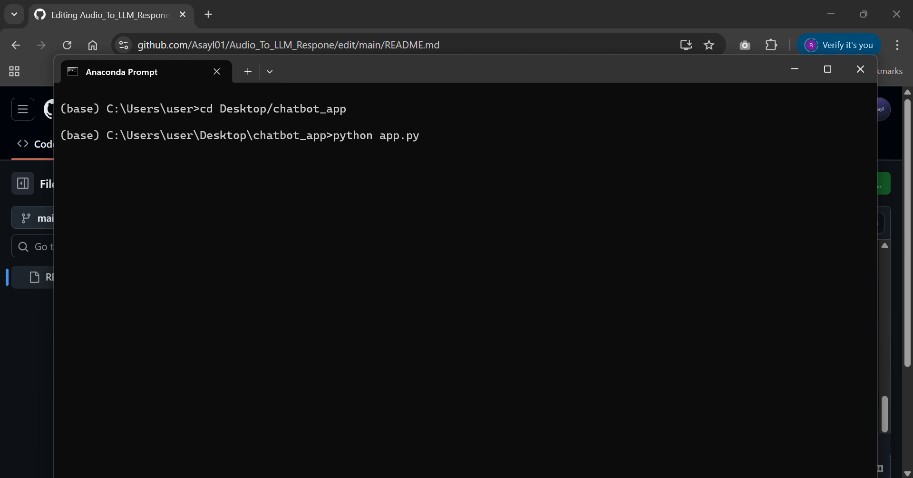

# Audio to LLM Response

A real-time voice chatbot that captures user speech and responds with generated audio replies using a Large Language Model (LLM).

##  Table of Contents

-   [Core Functionality](#-core-functionality)
-   [Project Structure](#-project-structure)
-   [Tech Stack & Requirements](#-tech-stack--requirements)
-   [Setup and Installation Guide](#️-setup-and-installation-guide)
    -   [Step 1: System Prerequisites](#step-1-system-prerequisites)
    -   [Step 2: Project Files](#step-2-project-files)
    -   [Step 3: Install Python Libraries](#step-3-install-python-libraries)
    -   [Step 4: (Optional) Test Whisper Independently](#step-4-optional-test-whisper-independently)
    -   [Step 5: Configure API Key](#step-5-configure-api-key)
-   [Running the Full Application](#️-running-the-full-application)
  
### Core Functionality
1.   **Record:** Captures audio from the user's microphone.
2.   **Transcribe:** Converts the audio to text using **Whisper**.
3.   **Generate:** Generates an intelligent response using **Cohere**.
4.   **Synthesize:** Converts the text response back to audio using **gTTS**.
5.   **Play:** Automatically plays the audio response to the user.

---

##  Project Structure

The project directory is organized as follows to ensure Flask operates correctly.

```
chatbot_app/
│
├── app.py              # Main Flask server, handles all backend logic
│
├── templates/
│   └── index.html      # The HTML structure for the user interface
│
└── static/
    ├── style.css       # All CSS for styling the UI
    ├── script.js       # Frontend JavaScript for audio and API handling
    └── robot.png       # The chatbot's avatar icon
```
---

##  Tech Stack & Requirements

| Category      | Technology                                                                                          |
| :------------ | :-------------------------------------------------------------------------------------------------- |
| **Frontend**  | `HTML5`, `CSS3`, `Vanilla JavaScript`                                                               |
| **Backend**   | `Python 3.8+`, `Flask`, `Flask-CORS`                                                                |
| **AI & APIs** | `openai-whisper` (Speech-to-Text), `cohere` (LLM), `gTTS` (Text-to-Speech)                           |
| **Core Libs** | `Numpy`, `Scipy`                                                                                    |
| **System**    | `FFmpeg` (Required for audio processing)                                                            |
| **Dev Env**   | `Anaconda`                                                                                          |

---

##  Setup and Installation Guide

Follow these steps carefully to set up the project environment.

### Step 1: System Prerequisites

Before installing the project libraries, ensure your system has the following:

-   **Python 3.8 or newer**: Verify your installation by running `python --version`.
-   **FFmpeg**: This is a critical dependency for audio processing.
    -   Download it from the [**official FFmpeg website**](https://ffmpeg.org/download.html ).
    -   Install it and ensure its executable's location is added to your system's `PATH` variable.

### Step 2: Project Files

Clone the repository or download the source code to your local machine.

```bash
# Clone the repository using Git
git clone https://your-repository-url.git

# Navigate into the newly created project directory
cd your-project-directory
```
> *Alternatively, you can download the project as a ZIP file and extract it manually.*

### Step 3: Install Python Libraries

Open your terminal or Anaconda Prompt inside the project directory and run the following command to install all required packages:

```bash
pip install Flask Flask-CORS openai-whisper cohere gTTS numpy scipy
```

### Step 4: (Optional ) Test Whisper Independently

Before running the full web application, you can perform a quick test to ensure the core speech-to-text functionality is working.

1.  Create a temporary Python file named `test_whisper.py` in your project folder and paste the following code into it:
    ```python
    import whisper
    import sounddevice as sd
    from scipy.io.wavfile import write
    import numpy as np

    FS = 16000
    SECONDS = 5
    FILENAME = "test_output.wav"

    print("Recording for 5 seconds...")
    myrecording = sd.rec(int(SECONDS * FS), samplerate=FS, channels=1, dtype='int16')
    sd.wait()
    write(FILENAME, FS, myrecording)
    print("Recording finished.")

    model = whisper.load_model("base")
    result = model.transcribe(FILENAME, language="ar")
    print("Transcription Result:")
    print(result["text"])
    ```
2.  Run the test script from your terminal:
    ```bash
    python test_whisper.py
    ```
3.  The script will record 5 seconds of audio from your microphone and then print the transcribed text.

> **Note on Arabic Text:** It is normal for Arabic text to appear reversed or disconnected in standard Windows terminals (like `cmd` or `Anaconda Prompt`). This is a display issue with the terminal itself and **does not affect the functionality of the program**. The text is processed correctly in the backend.
>
> `مرحبا` might look like `ا ب ح ر م` in the terminal, but it's handled correctly by the application.

### Step 5: Configure API Key

The chatbot relies on the Cohere API to generate responses.

1.  Go to [**cohere.com**](https://cohere.com ) and sign up for a free developer account.
2.  From your dashboard, generate a new **Trial API Key**.
3.  Open the `app.py` file in your code editor.
4.  Locate the line for the API key and paste your key as a string:

    ```python
    # Replace the placeholder with your actual key
    COHERE_API_KEY = "pAStE_yOuR_kEy_HeRe"  # ⚠️ Important: Do NOT share this key publicly!
    ```
5.  Save the `app.py` file.

---

##  Running the Full Application

Once all the setup and configuration steps are complete, you are ready to launch the chatbot.

1.  **Start the Server**: In your terminal (while inside the project directory), run the main Python script:
    ```bash
    python app.py
    ```
2.  **Access the Application**: After the server starts, you will see a confirmation message. Open your web browser and navigate to:
    > ### **`http://127.0.0.1:5000`**
3.  **Grant Permissions**: The first time you click the microphone icon, your browser will prompt you for microphone access. **You must click "Allow"** for the application to work.
4.  **Start Talking**: Click the microphone icon and enjoy your conversation with the AI!

# Demo
The GIF below shows a quick visual preview of the voice chatbot in action.


The following videos include a simple explanation of how the chatbot works and how to run it from the terminal:
- [app_p1.mp4](https://drive.google.com/file/d/1F2YDOvILWnljDKT8UxbPJzMQERK9ubLq/view?usp=sharing)
- [app_p2.mp4](https://drive.google.com/file/d/1fbkfrmnAY05OgITJ6LqegSfauZ5MDhLD/view?usp=drive_link)
- [app_p3.mp4](https://drive.google.com/file/d/157acUuV6CHriRnQqx5aBSl-sDLYtPZvA/view?usp=drive_link)
